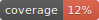

# sw-metadata-bot

[](https://doi.org/10.5281/zenodo.19468976)
[](LICENSE)
[](https://github.com/SoftwareUnderstanding/sw-metadata-bot/releases)
[](https://www.python.org/downloads/)
[](https://github.com/SoftwareUnderstanding/sw-metadata-bot/actions/workflows/ci.yml)
[](https://github.com/astral-sh/ruff)



An automated bot that analyzes repository metadata quality and creates issues with improvement suggestions.

Part of the [CodeMetaSoft](https://w3id.org/codemetasoft) project to improve research software metadata quality.

---

## 📋 What This Bot Does

If you received an issue from this bot, it means your repository's metadata was automatically analyzed and some improvements were detected on the main default branch.

The issue contains:

- **Pitfalls**: Critical metadata issues that should be fixed
- **Warnings**: Metadata improvements that are recommended
- **Suggestions**: Specific recommendations on how to fix each issue
- **Codemeta.json generation**: if your repo does not contain any `codemeta.json` file, the bot suggests one.  

### Example Issues You Might See

```md
### [P002](https://w3id.org/rsmetacheck/catalog/#P002)
**Evidence:** P002 detected: LICENSE file contains unreplaced template placeholders

**Suggestion:** Update the copyright section with accurate names, organizations, and the current year. Personalizing this section ensures clarity and legal accuracy.
```

---

## 💬 How to Respond

### If You Agree with the Suggestions

Fix the identified issues and **close the issue** with a comment explaining what you fixed. Your improvements help your software become more discoverable and citable!

### If You Disagree or Have Questions

Feel free to **comment on the issue**. We're happy to discuss the suggestions and help clarify what's needed.

### If You're Not Interested

Simply comment **"unsubscribe"** on the issue and we'll remove your repository from future analysis.

---

## 🔍 What Analysis Is Used

This bot uses [RSMetaCheck](https://github.com/SoftwareUnderstanding/RsMetaCheck), which analyzes:

- Software metadata completeness
- Citation and documentation quality
- Repository structure and best practices

The bot **does not**:

- Modify your code or files
- Make pull requests
- Have access to your repository secrets

---

## 📚 Learn More

- [CodeMetaSoft Project](https://w3id.org/codemetasoft) - About the initiative
- [RSMetaCheck](https://github.com/SoftwareUnderstanding/RsMetaCheck) - The analysis tool
- [Citation File Format](https://citation-file-format.github.io/) - How to add CITATION.cff

---

## 🛠️ For Maintainers Running This Bot

See [CONTRIBUTING.md](CONTRIBUTING.md) for setup and usage instructions.

The pipeline is config driven: one JSON file defines the repository list, issue message, inline opt-outs, and output layout.

Supported platforms:

- ✅ GitHub.com
- ✅ Gitlab.com

The bot is handling self-hosted gitlab platform but requires providing a token to this server (and not gitlab.com).

---

## 📝 License

See [LICENSE](LICENSE) file.
